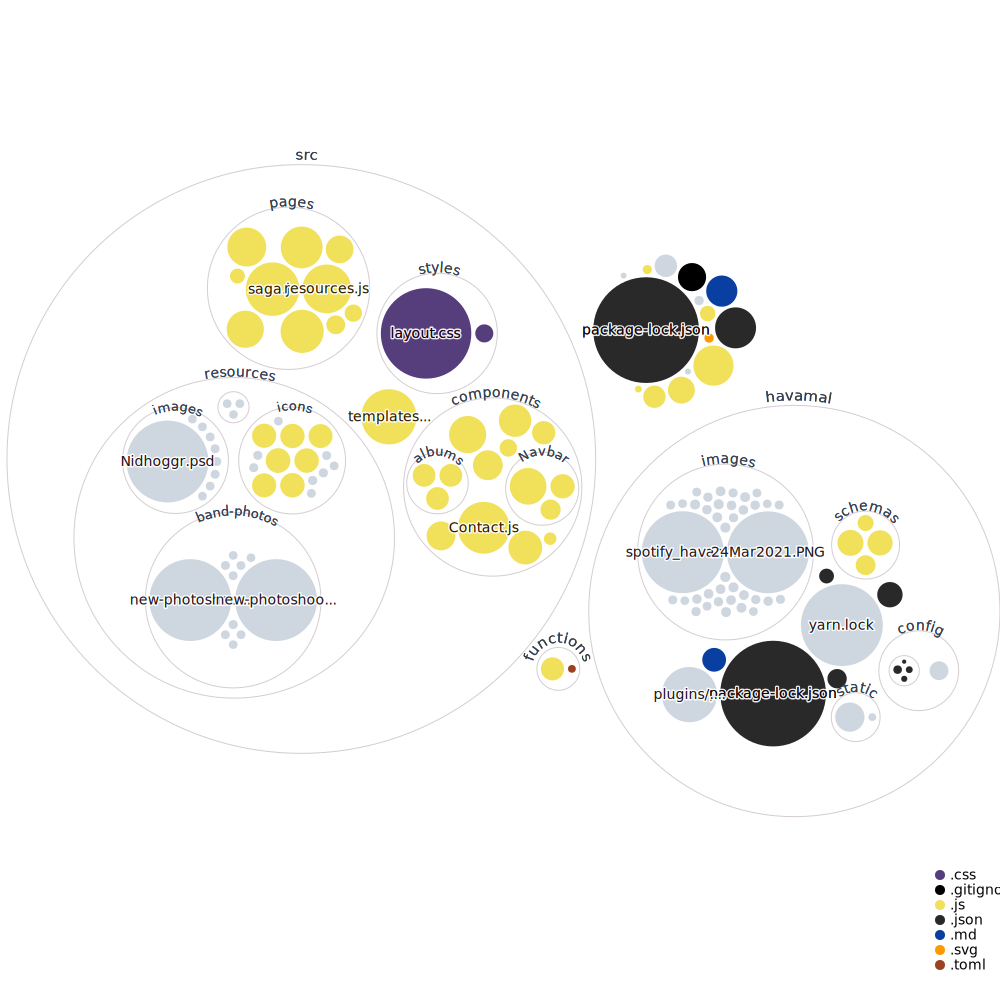

  

<h1 align="center">Hail Havamal!</h1>

### Website for the Swedish band **[HAVAMAL](https://havamalband.com)**

### This website is built using these resources and technologies:

* GatsbyJS
* Sanity CMS
* Cloudinary
* TailwindCSS
* Styled-Components

This started as a Gatsby project for Vets Who Code. I started it, then scrapped it, started again, then wrote the entire project in HTML, CSS, and JavaScript. 

I wasn't happy with the result and felt limited. I decided to re-write the project in Gatsby so I could work with React and incorporate some features from Gatsby.  My goal was to learn different technologies while improving the speed and usability of the website.

Wanting to expand my knowledge of CSS frameworks, I began styling with TailwindCSS, then added styled-components to fill in some gaps.

This site is currently being upgraded to GatsbyJS v3 so updates are not as frequent, for the time being. 

### Workflow Visualization
